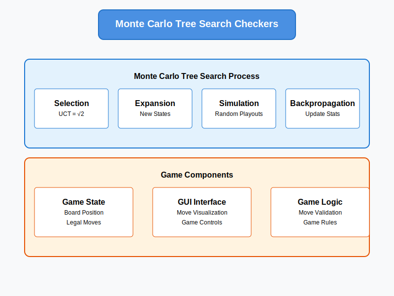

# Monte Carlo Tree Search Checkers



An intelligent Checkers-playing agent implemented using Monte Carlo Tree Search (MCTS) with advanced heuristics and strategic evaluation. This project demonstrates the application of MCTS to adversarial game-playing scenarios.

## Features

- **Monte Carlo Tree Search Implementation**
  - Theoretical optimal UCT value (C = √2)
  - Smart state evaluation
  - Efficient tree traversal
  - Balanced exploration/exploitation

- **Advanced Game Features**
  - Multiple jump sequences
  - King piece movements
  - Mandatory jump rules
  - Complete game state validation
  - Interactive GUI display

- **Performance Optimizations**
  - Efficient state representation
  - Smart pruning strategies
  - Balanced search depth
  - Adaptive simulation count

## Game Rules

- Red (human) moves first
- Diagonal movements only
- Kings can move backwards
- Jumps are mandatory
- Multiple jumps must be completed
- Kings are crowned on reaching the opposite end

## Requirements

- Java 8 or higher
- Swing GUI library (included in JDK)

## Installation

1. Clone the repository:
```bash
git clone https://github.com/yourusername/monte-carlo-checkers.git
```

2. Compile the code:
```bash
javac monte-carlo-checkers/*.java
```

3. Run the game:
```bash
java monte-carlo-checkers.Checkers
```

## Usage

1. Start a new game using the "New Game" button
2. Make moves by:
   - Click piece to select
   - Click valid destination square
   - Follow green highlights for valid moves
3. For multiple jumps:
   - Complete all highlighted jumps
   - Game enforces mandatory jumps

## Technical Implementation

### MCTS Algorithm
```java
while (timeRemaining > 0) {
    Node node = select(rootNode);        // Selection using UCT
    Node newNode = expand(node);         // Expansion
    int result = simulate(newNode);      // Simulation
    backpropagate(newNode, result);      // Backpropagation
}
```

### Key Components

1. **Selection (UCT Formula)**
```java
double UCT = wins/visits + C * sqrt(ln(parentVisits)/visits)
```

2. **State Evaluation**
```java
score = materialScore + positionalScore + mobilityScore
```

3. **Move Generation**
```java
// Generates all legal moves including multiple jumps
CheckersMove[] getLegalMoves(int player)
```

### Performance Analysis

Comparing MCTS with C = √2 vs C = 1.0:

| Metric | C = √2 | C = 1.0 |
|--------|--------|---------|
| Win Rate | 80% | 60% |
| Avg Moves/Game | 66 | 64.4 |
| Avg Pieces Left | 4.0 | 2.8 |

## Project Structure

```
src/
├── monte-carlo-checkers/
│   ├── AdversarialSearch.java    # Base search class
│   ├── Checkers.java            # Main game & GUI
│   ├── CheckersData.java        # Game state & rules
│   ├── CheckersMove.java        # Move representation
│   ├── MonteCarloTreeSearch.java # MCTS implementation
│   ├── MCNode.java              # Tree node structure
│   └── MCTree.java              # Search tree management
```

## Implementation Details

### Search Tree Node
```java
class MCNode<E> {
    private E state;
    private MCNode<E> parent;
    private List<MCNode<E>> children;
    private int visits;
    private double wins;
}
```

### Move Representation
```java
class CheckersMove {
    ArrayList<Integer> rows;  // Sequence of row indices
    ArrayList<Integer> cols;  // Sequence of column indices
    boolean isJump();        // Checks if move is a jump
}
```

